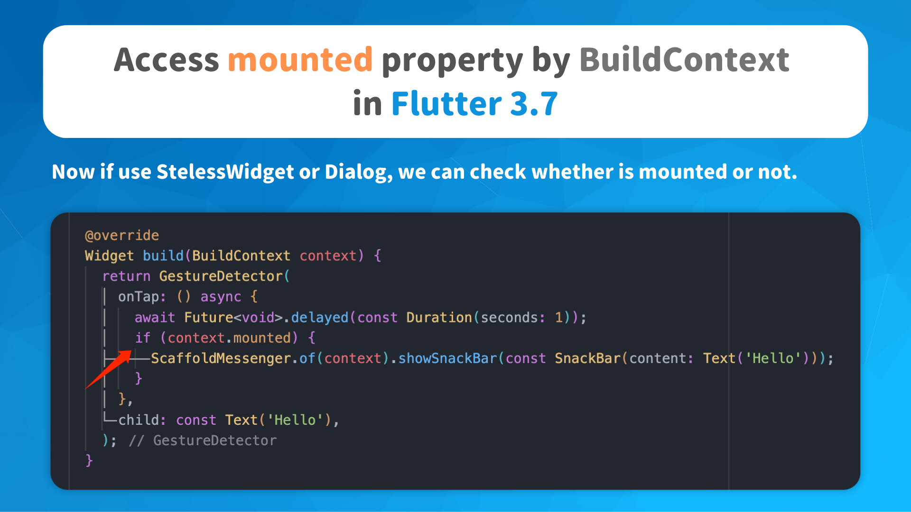

# Access mounted property by BuildContext in Flutter 3.7

- Now if use StatelessWidget or Dialog, we can check whether is mounted or not

- Make sure the current widget is still mounted to Widget Tree after doing some asynchronous operations

