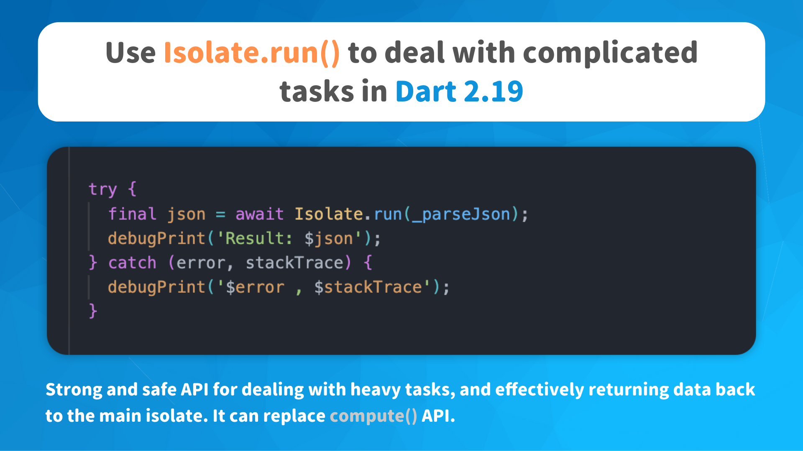

# Use Isolate.run() to deal with complicated tasks in Dart 2.19

- Strong and safe API for dealing with heavy tasks, and effectively returning data back to the main isolate. It can replace compute() API

